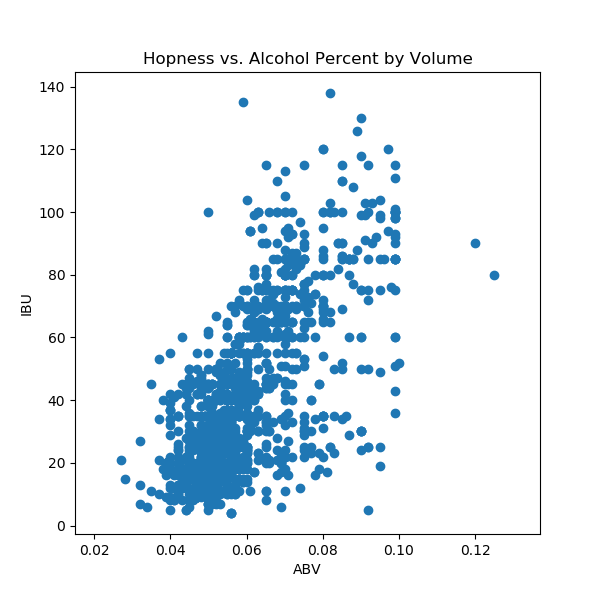
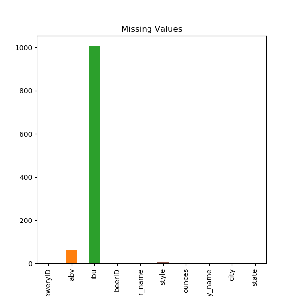
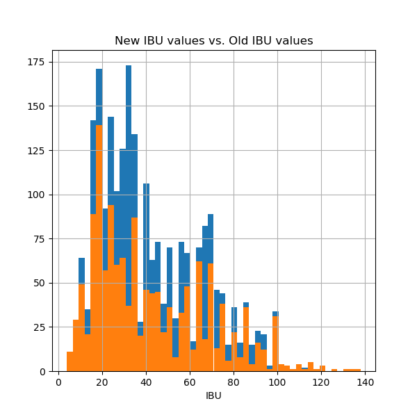

# Beer Recommender by Troy Kayne
<!-- Add a summary if necessary -->
## EDA

When observing my data, I initially observed the correlation between IBU and ABV values. Normally, a heavier beer has more hop. This linear correlation made sense to me. However, you can see that it would be difficult to hard cluster this data by beer category.



I noticed that there was a large number (over half) of IBU, small amount of ABV, and a slither of styles values missing.



This feature along with ABV is crucial for determining similar beers. I could not drop these rows because it takes up most of my data, and I can not ignore them. So I used KNN to impute these values. In the next figure, you can see how the KNN impute worked.



The blue bins indicate the new data. You can see how the two colored histograms have very similar shapes. The KNN was clearly the best way to impute these missing values.


## LDA Results

| Topic Number | Topics | Possible Category |
| --- | --- | --- |
| 0 |'ipa' 'double' 'imperial' 'black' 'kölsch' 'hop' | IPAs |
| 1 |'porter' 'altbier' 'imperial' 'russian' 'barrel' 'baltic'| Porters |
| 2 |'stout' 'oatmeal' 'winter' 'warmer' 'milk' 'sweet'| Stouts |
| 3 |'beer' 'pilsner' 'pilsener' 'rye' 'fruit' 'vegetable'| Pilsners |
| 4 |'ale' 'pale' 'lager' 'apa' 'amber' 'red'| APAs |
| 5 |'cider' 'berliner' 'apple' 'weissbier' 'hard' 'dry'| Ciders |
| 6 |'ale' 'blonde' 'witbier' 'strong' 'belgian' 'golden'|  Golden/Blondes |

## Input/Output Vectors

I vectorized all documents in my beer dataset in this fashion. The last two columns of my vector are weighted much higher than the topic probabilities because they are more significant for determining similarity.

| Topic probabilities | ABU | IBU|
| --- | --- | --- |
|[0.01820796, 0.41002485, 0.01818473, 0.01818347, 0.01818821,0.01818524, 0.49902553]|1.21|0.62|
|... |... |... |

After having my entire dataset transformed in this nature, I used cosine similarity to measure the distances among all vectors. After sorting them, I took the first 10 to be associated as most similar beers when given a favorite beer.

## Example

Recommendation of Beer within Dataset
```
{
  'Hard Apple': [
    'Ginger Cider',
    "Wolfman's Berliner",
    'Schilling Hard Cider',
    'Hard Cider', 'Nomader Weiss',
    'Monkey Chased the Weasel',
    'Magic Apple',
    'Contemplation',
    'Totally Radler'
    ]
}
```
The 'Hard Apple' is a beer inside my dataset. I originally designed my topic modeler to compare similarity with beers within the dataset, just to get it working. Then, I added a couple methods in my topic modeler to compare similarity with a user's preference.

Recommendation for User's preference
```
{
  'target_beer': 'Voodoo Ranger Imperial IPA',
  'recommendations': [
    'Valkyrie Double IPA',
    'Northern Lights India Pale Ale',
    'Northern Lights India Pale Ale',
    'Jockamo IPA',
    'White Reaper',
    'Jai Alai IPA Aged on White Oak',
    'Humidor Series India Pale Ale',
    'The Great Return',
    'Jai Alai IPA',
    'Tripel Deke'
    ]
}
```

Input

| Beer | ABV | IBU | Style |
| --- | --- | --- | --- |
| Voodoo Ranger Imperial IPA | 0.09 | 90 | Imperial IPA |

Recommendations

| Beer | ABV | IBU | Style |
| --- | --- | --- | --- |
| Valkyrie Double IPA | 0.092 | 100.0 | American IPA |
| Northern Lights India Pale Ale | 0.065 | 52.0| American IPA |
| Jockamo IPA | 0.065 | 52.0 | American IPA |
| White Reaper | 0.07 | 61.0 | Belgian IPA |
| Jai Alai IPA Aged on White Oak | 0.075 | 70.0 | American IPA |
| Humidor Series India Pale Ale | 0.075 | 70.0 | American IPA |
| The Great Return | 0.075 | 70.0 | American IPA|
| Jai Alai IPA | 0.075 | 70.0 | American IPA |
| Tripel Deke | 0.082 | 81.67 | Tripel |


## Demo
run `app.py`

Visit http://localhost:8080
